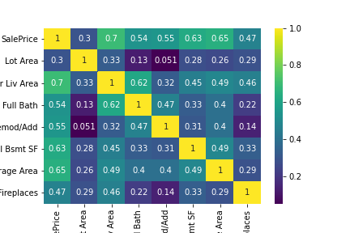

# Ames Housing Data and Kaggle Challenge
#### Author: Alonzo Mays

# Contents
#### I. Problem Statement

#### II. Data Dictionary
#### III. The Modeling Process
#### IV. Conclusions/Recomendations

# I. Problem Statement

The housing market in Ames, Iowa is seeing a sudden rise. Developer A wants to make data driven 
 decisions that will help it capture more revenue and market share.  They need help 
 deciding what key home features to focus on to increase home sale prices.
## II. Data Dictionary
<a href='https://www.kaggle.com/c/dsi-920-ames/data'>Data Dictionary Link</a>
## III. The Modeling Process
#### <u>EDA</u>
The dataset consisted of 82 columns and 2051 rows.  After doing an intial heatmap to see what the top features were that correlated mostly to price, I decided to use the top 7.

#### <u>Data Insights</u>
- I used 7 key features that correlated with the highest home sale prices
-The Ground living area feature was the highest correlated, and lot area feature was the lowest correlated
-A common theme in the feature analysis was relative normally distribution with few outliers
-**Linear Regression** demonstrated the highest model score over Lasso and Ridge Regression. The 7 features I selected resulted in 
 a higher regression score, 87% than the baseline case of 82%. 
-When poly features were put into the model they did not improve the model. the linear regression model had the best result.  
- Actual Median Price: $181,469.70
-Predicted Median Price: $182,948.36
-MSE: 789852654.64
-Cross Validation Score: 82.2%
-Model test score: 87.13%

## IV. Conclusion/Recommendations:
- Based on the model, we should focus on these 7 features: Lot Area, Ground Living Area, Full Baths, Year Remodeled/Add, Total Bsmt SF, Garage Area, Fireplaces
-Data shows no real rewards for heavy specialization on only one feature (polynomial transformation)
-These features should be focused on simultaneously when developing more homes to keep sale prices the highest.
-Since Lot Size and Garage Size were the highest features, Developer A should consider increasing lot sizes and garage sizes creatively during construction. 
